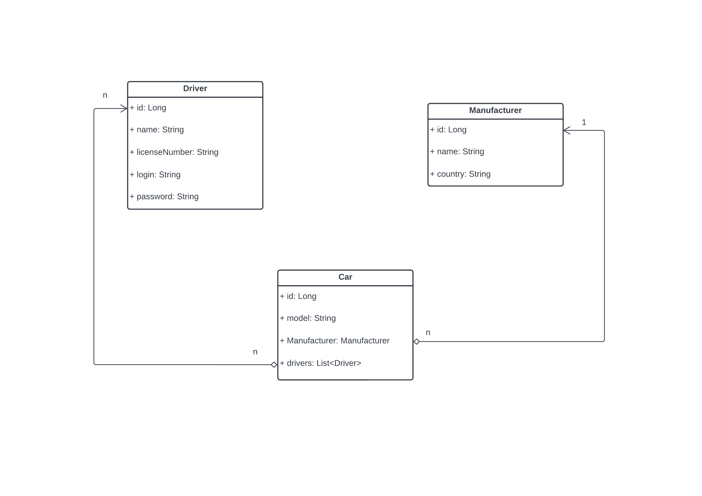

# Taxi-service

# Description
- This is a web application that represents the work of a taxi service. It has backend and frontend parts and is implemented using technologies such as `java`, `java-JSP`, `JDBC` `maven`, `tomcat`, `javax library`, `MySQL`
  Implemented such functions as `registration`, `login`, `logout`, `creation` and `deletion` of `cars`, `manufacturers` and `drivers`. Implemented a `web filter` to control authorized users.
  A detailed description of the project will be given below. The basic front-end was implemented using JSP to interact with database.
  
- The database consists of 4 tables such as `cars`, `drivers`, `cars_drivers` and `manufacturer`. it is possible to create driver machines, create and add to them machines, login and logout are also implemented.
# Used technologies : 
- `Java 11`
- `Java-JSP`
- `JSTL`
- `JDBC` 
- `Maven`
- `Tomcat`
- `MySQL` 
- `Servlet`

# Data structure

# Project start instructions :
  - Install MySQL, Tomcat, Java, Maven, Git
  - Clone a newest version of the project
  - Create db structure using script from resources/init_db.sql file. 
  - You need to change the database connection settings such as `name`, `url` and `password`. To do this, go to the 
  `taxi/util/ConnectionUtil` folder and change the parameters we need.
